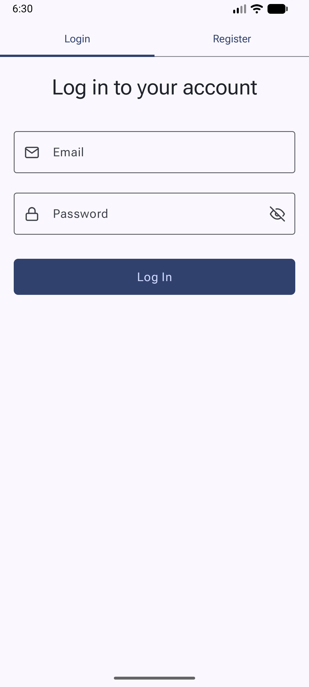
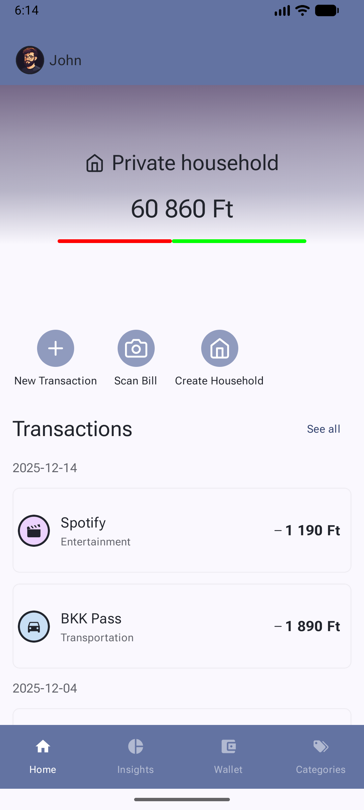
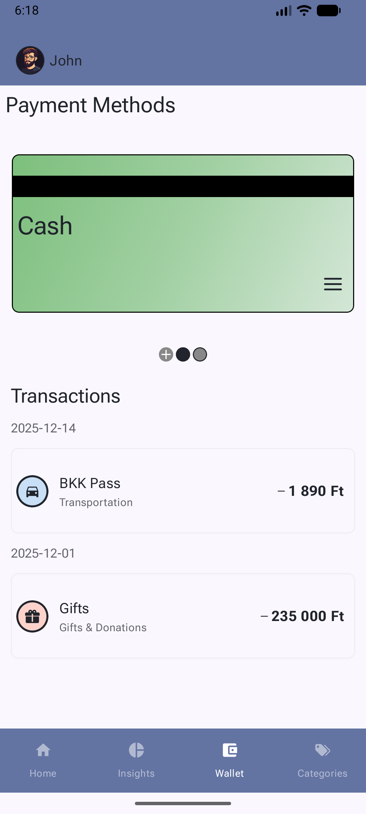
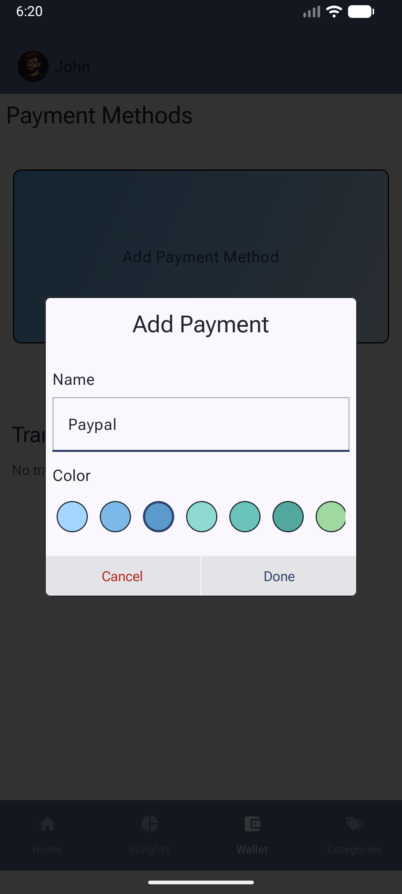
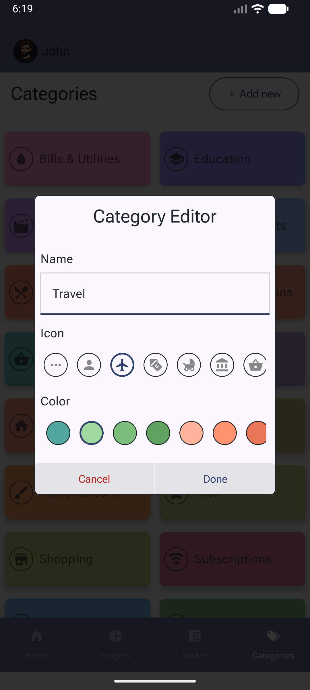
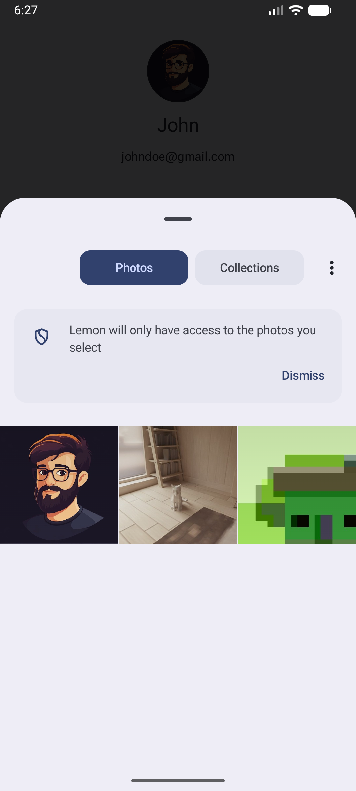
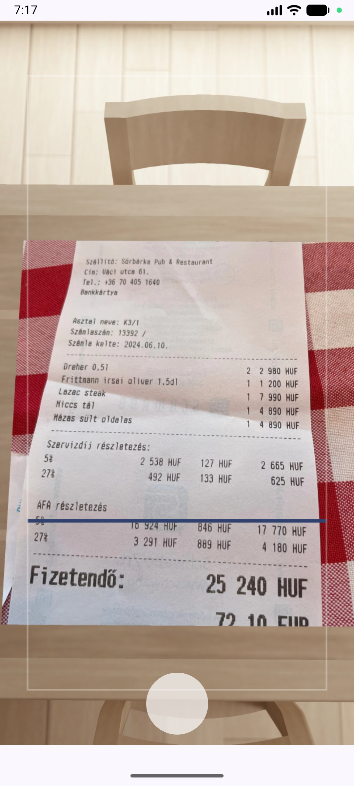

# Lemon
An Android application to track your spending. The app provides an easy-to-use, modern interface that helps users track and analyze their expenses. Its goal is to increase financial awareness by offering transparent and practical tools for everyday money management.

## Main Features

- **Multi-user Household Management**: Create and manage households with multiple members, allowing families to track shared finances
- **Transaction Tracking**: Easy-to-use interface for recording expenses and income with categorization
- **AI-Powered Receipt Scanning**: Automatically extract transaction details from receipts using Google Gemini AI
- **Financial Insights**: Visual analytics including category breakdown (pie chart), monthly expense distribution, and income trends
- **Payment Method Management**: Create and manage multiple payment methods (cash, card, bank account) and share them across household members
- **Flexible Categorization**: Create custom expense categories for better organization and tracking
- **Secure Authentication**: Email and password-based authentication with automatic session management
- **Row-Level Security**: Database-level permissions ensure users only access their own and their household's data

## User Guide

### Login Screen
Authenticate or create a new account:
- **Login**: Sign in with your email and password
- **Registration**: Create a new account by switching to the registration page
- **Session Management**: Your session is automatically managed and persisted

### Home Screen

The home screen displays your household's most recent transactions. Key features include:
- **Transaction List**: View latest transactions at the top of the screen
- **See All Transactions**: Access all transactions organized by month
- **New Transaction**: Create a transaction manually
- **Scan Bill**: Use your device camera to scan a receipt, which extracts transaction details automatically using AI
- **Create Household**: Set up a new household for expense tracking
- **Swipe Between Households**: Navigate between your households with a swipe gesture
- **Household Details**: Tap the household name to view and manage household settings and members

### Insights
- **Category Distribution**: Pie chart showing expense breakdown by category
- **Monthly Overview**: Bar chart displaying monthly spending patterns across the year
- **Income Tracking**: Line chart showing monthly income trends
- **Interactive Analytics**: Tap on categories or months to see detailed breakdowns

### Wallet
Manage your payment methods:
- View all payment methods and associated transactions
- Create new payment methods with custom colors and icons
- Edit or delete existing payment methods
- Share payment methods with household members

### Categories
Manage expense categories specific to your household:
- Create custom categories with icons and colors
- Edit or delete categories by long-pressing
- Track spending by each category

### Profile
Access your account settings by tapping your profile picture:
- Update your username
- Upload and change your profile picture
- View account information
- Sign out

### AI Bill Scanner
Automatically extract transaction data from receipt images:
- **Camera Capture**: Use CameraX to capture receipt images with live preview
- **AI Processing**: Google Generative AI (Gemini) analyzes the image and extracts relevant information including:
  - Total amount
  - Transaction date
  - Merchant details
  - Item details
- **Review & Edit**: Preview the extracted data and make corrections before saving
- **Auto-Fill**: Transaction details are automatically populated, and you can save it with a single tap

## Technologies

- **Jetpack Compose**: Modern declarative UI framework for building reactive, interactive user interfaces
- **Kotlin Flow & StateFlow**: Reactive stream handling for state management and data flow
- **CameraX**: Jetpack library for easy camera integration and receipt scanning
- **Coil**: Image loading library for efficient profile picture handling and caching
- **Clean Architecture**: Three-layer architecture (data, domain, presentation) for maintainable, scalable code
- **MVI Pattern**: Model-View-Intent pattern for the presentation layer with centralized event handling
- **Dagger Hilt**: Dependency injection framework for managing dependencies across architecture layers
- **Supabase**: Backend-as-a-Service platform providing:
  - **Authentication**: Email and password-based user registration and login
  - **PostgreSQL Database**: Relational database with Row Level Security (RLS) for user data isolation
  - **Remote Procedure Calls (RPC)**: Server-side plSQL functions for complex aggregations and statistics
  - **Storage**: Secure file storage for user profile pictures
- **Room Database**: Local caching of frequently accessed data
- **Google Generative AI (Gemini)**: AI model for intelligently extracting data from receipt images

## API References

The application uses **Supabase** as the primary backend platform. Key API documentation resources:

- **Supabase Documentation**: https://supabase.com/docs
- **Authentication API**: User registration, login, and session management via `supabase-auth-kt`
- **Database API**: PostgreSQL queries and RPC functions via `postgrest-kt`
- **Storage API**: Profile picture upload and retrieval via `storage-kt`
- **Google Generative AI API**: Receipt scanning and data extraction via `generativeai-google`

For detailed database schema information, see the `supabase/schema/` directory which contains:
- `tables.sql`: Core data models
- `functions.sql`: RPC functions for complex queries
- `rls.sql`: Row-level security policies
- `policies.sql`: Additional security policies
- `views.sql`: Database views for data aggregation
